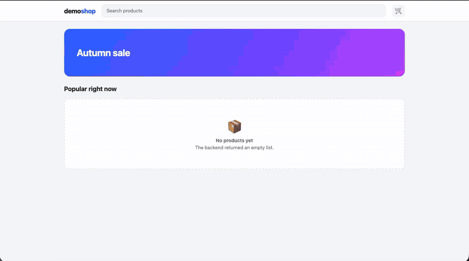

<p align="center">
  
</p>

<h1 align="center">oMockman</h1>

<p align="center">
  <a href="https://github.com/ozontech/oMockman/actions/workflows/ci.yml"></a>
  <a href="https://codecov.io/gh/ozontech/oMockman"></a>
  <a href="https://github.com/ozontech/oMockman/releases"></a>
  <a href="LICENSE.md"></a>
  <br>
  
  
  
  <a href="CONTRIBUTING.md"></a>
</p>

<p align="center"><a href="README.md">English</a> | <b>Русский</b></p>

oMockman - расширение для DevTools, которое подменяет ответы `fetch` и `XMLHttpRequest`
прямо в браузере. Прокси поднимать не нужно, приложение пересобирать тоже.

В DevTools появляется вкладка **Mockman**. В ней две части: **Mocks** - правила подмены,
и **Logs** - все запросы страницы, из любого можно сделать мок в один клик.

Что умеет:

- подменять статус, тело, заголовки и добавлять задержку ответа;
- мокать по методу и URL, в том числе динамические пути (`/users/:id`, `(.*)`);
- записывать моки из реальных запросов кнопкой **Record**;
- раскладывать моки по коллекциям с папками, импортировать и экспортировать их;
- подставлять переменные окружения в URL (`{BASE_URL}/api`) и переключать среды;
- проверять тело ответа по OpenAPI-схеме и подсвечивать расхождения прямо в редакторе;
- генерировать тело ответа через AI - подключается любой OpenAI-совместимый API;
- показывать на странице, сколько запросов сейчас замокано.

Работает в Chrome (Manifest V3) и Firefox (Manifest V2).

<p align="center">
  
</p>

---

## Чем отличается от аналогов

Обычно для подмены ответов берут Postman, Proxyman, Charles или Fiddler. Инструменты мощные,
но это отдельные приложения: их надо запускать рядом с браузером, а иногда ещё поднимать прокси
и доверять его сертификату. Браузерные расширения проще, но чаще всего закрывают только базовый
сценарий - подменить один ответ.

oMockman закрывает весь цикл работы с моками прямо в DevTools:

- **Живёт рядом с Network.** Никаких отдельных окон и прокси, запрос из логов превращается в мок в один клик.
- **Коллекции как в Postman.** Папки и подпапки, включение и выключение целой группы одной кнопкой.
- **Импорт и экспорт в JSON.** Набор моков легко передать другой команде вместе со структурой папок.
- **Проверка по OpenAPI.** Тело мока сверяется со Swagger-схемой, расхождения с контрактом подсвечиваются в редакторе.
- **Генерация ответов через AI.** Валидные тестовые данные, граничные случаи или ошибка по схеме - через любой OpenAI-совместимый API.
- **Редактор JSON** с подсветкой ошибок формата и форматированием.
- **Chrome и Firefox** из одной кодовой базы.

---

## Быстрый старт

1. Установите расширение (см. [Установка](#установка)).
2. Откройте сайт, запросы которого хотите подменить.
3. Откройте DevTools: `F12` или `Cmd+Option+I` на Mac, и перейдите на вкладку **Mockman**.
4. При первом открытии на сайте появится плашка - нажмите **Разрешить и перезагрузить**.

Дальше два способа:

- **Вручную** - кнопка **Add Mock**, заполнить URL, метод, статус и тело ответа.
- **Из логов** - на вкладке **Logs** у нужного запроса нажать **Mock**. Поля подставятся сами,
  останется поправить ответ.

---

## Установка

### Из релиза

Скачайте последнюю сборку со страницы [Releases](https://github.com/ozontech/oMockman/releases):
`omockman-chrome-*.zip` для Chrome, `omockman-firefox-*.xpi` для Firefox.

- **Chrome**: распакуйте архив, откройте `chrome://extensions`, включите *Режим разработчика*,
  нажмите *Загрузить распакованное* и выберите папку.
- **Firefox**: откройте `about:debugging` → *Этот Firefox* → *Загрузить временное дополнение*
  и выберите `.xpi`. Обычный Firefox ставит насовсем только подписанные дополнения, поэтому для
  постоянной установки нужен Firefox Developer Edition или Nightly.

### Из исходников

```bash
git clone https://github.com/ozontech/oMockman.git
cd oMockman
npm ci
npm run build:chrome     # dist/chrome
npm run build:firefox    # dist/firefox
```

Дальше загрузите `dist/chrome` или `dist/firefox` так же, как выше. Нужен Node.js 24 (см. `.nvmrc`).

---

## Разработка

<details>
<summary>Команды и где что лежит в коде.</summary>

```bash
npm ci              # зависимости
npm run dev         # dev-сервер для панели
npm test            # юнит-тесты (vitest)
npm run lint        # eslint, stylelint и tsc
npm run playwright  # e2e на собранном расширении
```

Перед `npm run playwright` соберите расширение: `npm run build:chrome`.
Те же команды есть в `Makefile`: `make build`, `make test`, `make lint`, `make e2e`.

| Путь | Что там |
|---|---|
| `src/panel` | панель DevTools (React, Zustand, Semantic UI) |
| `src/content-script.ts`, `src/contentScript` | изолированный мир: хранит моки и сопоставляет запросы |
| `src/inject` | код в мире страницы: перехватывает `fetch`/`XHR`, данных не хранит |
| `src/background.ts`, `src/background` | service worker: заголовки ответов, запросы к AI и OpenAPI |
| `src/services` | общая логика: сопоставление URL, JSON, переменные, AI-клиент |
| `public/chrome`, `public/firefox` | манифесты и статика под каждый браузер |

</details>

---

## Как устроен перехват

<details>
<summary>Моки не попадают в страницу: она получает только ответ на свой запрос.</summary>

Расширение живёт в изолированном мире браузера, а `window.fetch` принадлежит странице.
Чтобы подменить `fetch`, нужен скрипт внутри самой страницы - а всё, что видит этот скрипт,
может прочитать и страница.

Поэтому oMockman разделён на две части:

- моки хранятся в изолированном мире и в страницу не передаются;
- на каждый перехваченный запрос код в странице спрашивает только про этот запрос и получает
  в ответ либо «не мокается», либо готовый ответ;
- общаются они через приватный `MessagePort`, который передаётся до того, как на странице
  запустится хоть один её скрипт.

Если связь не поднялась, мокирование просто выключено и запросы идут в сеть как обычно.

Синхронный `XMLHttpRequest` (`open(..., false)`) не может дождаться такого ответа, поэтому не мокается.

</details>

---

## Доступ к сайтам

<details>
<summary>Моки работают только на сайтах, которые вы разрешили. Один клик на сайт.</summary>

Подмена идёт по методу и URL. Без разрешений любая страница могла бы угадать внутренний URL
и прочитать тело мока: ответ приходит раньше, чем запрос уходит в сеть, и CORS тут не спасает.

- Доступ выдаётся на **origin** - схема, хост и порт. `https://site.ru`, `http://site.ru`
  и `https://site.ru:8443` - три разных сайта.
- Разрешение действует на все моки сразу. Моки могут указывать на любой хост: фронт на
  `app.example.ru` может мокать `api.example.ru`.
- Сайт внутри iframe проверяется по своему origin, а не по origin страницы вокруг.
- Origin берётся из браузера, страница подделать его не может.

Если сайт не разрешён, панель покажет плашку с кнопкой **Разрешить и перезагрузить**.
Перезагрузка нужна, потому что уже ушедшие запросы задним числом не замокать.
Логи при этом пишутся в любом случае - не работает только подмена.

Запрос, который страница делает в первые мгновения загрузки, дожидается, пока расширение
подключится к странице, чтобы его тоже можно было замокать. Это занимает несколько
миллисекунд и не дольше секунды. Дальше на неразрешённом сайте запросы идут прямо в сеть,
так что на сайтах, где вы Mockman не используете, заметной задержки нет.

Список разрешённых сайтов - в **Настройки → Доступ к сайтам**, там же их можно отозвать.
Если не хочется подтверждать каждый сайт, там же включается **Автоматически разрешать все сайты**:
сайты будут попадать в список сами. По умолчанию это выключено - с этой галкой любая открытая
страница может прочитать ваши моки.

</details>

---

## Настройки

Почти всё - под шестерёнкой в шапке панели. Ничего, что расширяет доступ расширения,
по умолчанию не включено.

| Настройка | Где | По умолчанию |
|---|---|---|
| Доступ к сайту | плашка в панели → **Разрешить и перезагрузить** | не разрешён |
| Автоматически разрешать все сайты | Настройки → Доступ к сайтам | выключено |
| AI-подключения | Настройки → AI-подключения | нет ни одного |
| Разрешить http для локального AI | в каждом AI-подключении | выключено |
| Разрешить локальные OpenAPI-схемы (localhost, приватные адреса) | Настройки → Другое | выключено |
| Переменные для URL (`{BASE_URL}`) | Настройки → Среды и переменные | один пустой профиль `default` |
| Тема | Настройки → Другое | как в системе |
| Язык | Настройки → Другое | английский |
| Логирование запросов | переключатель в шапке | включено, пока открыта панель |
| Запись ответов в моки | переключатель в шапке | выключено |

<details>
<summary>AI-генерация ответов</summary>

Работает с любым OpenAI-совместимым API: публичным, корпоративным или локальным.
Подключение добавляется в **Настройки → AI-подключения**: имя, адрес сервера, модель и ключ.
Кнопка **Test connection** проверит, что всё заполнено верно. Чтобы не заполнять поля
руками, готовый конфиг можно вставить через **Import JSON**.

Рядом с кнопкой **Generate** в форме мока выбирается режим:

| Режим | Что генерирует |
|---|---|
| **Happy** | правдоподобные данные для успешного ответа |
| **Corner** | граничные случаи: пустые значения, длинные строки, спецсимволы |
| **Error** | ошибку по схеме, нужны статус 400–599 и OpenAPI-схема |

Если у мока указана OpenAPI-схема, ответ будет сгенерирован строго под неё - так точнее всего.
В настройках подключения можно задать общий промпт, например «все названия на русском».
Если модель обрезает JSON, увеличьте лимит токенов в настройках подключения.

</details>

---

## Права расширения

<details>
<summary>Зачем расширению каждое из разрешений браузера.</summary>

| Разрешение | Зачем |
|---|---|
| `<all_urls>` | стенды заранее неизвестны, мокать нужно на любом хосте |
| `webRequest` | только так можно прочитать заголовки ответа, которые CORS прячет от `fetch`; ничего не блокируется и не меняется |
| `storage` | моки, коллекции и настройки лежат в `chrome.storage.local` |
| `unlimitedStorage` | снимает лимит в 10 МБ, чтобы влезали моки с большими ответами |
| `tabs` | панели нужно знать, какую вкладку она смотрит |

Запросы и ответы собираются, только пока для вкладки открыта панель Mockman и включено
логирование. Заголовки с учётными данными (`set-cookie`, `authorization`, `x-api-key` и т.п.)
не сохраняются никогда.

Тела больше 20 МБ не сохраняются вообще, а не обрезаются, чтобы из обрезанного тела не
получился битый мок. Страница при этом получает полный ответ.

</details>

---

## Приватность

<details>
<summary>Нет бэкенда и телеметрии. Само расширение ходит только в AI, который вы настроили.</summary>

У oMockman нет своего сервера, аналитики и телеметрии. Всё хранится в `chrome.storage.local`
вашего браузера.

Единственный запрос, который расширение делает само, - в настроенный вами AI, и только
по кнопке **Generate**:

- AI по умолчанию выключен, в поставке нет ни адреса, ни ключа;
- адрес должен быть `https`, `http` разрешается только для `localhost` и только отдельной галкой;
- в запрос уходят URL, метод, статус и текущее тело мока, плюс кусок OpenAPI-схемы, если она
  указана. Не кладите в тело мока то, что не готовы отправить в этот AI;
- ключ хранится в `chrome.storage.local` без шифрования, как у любого расширения DevTools.

OpenAPI-схему скачивает фоновый скрипт. Localhost и приватные адреса он не открывает, пока
не включена галка **Разрешить локальные OpenAPI-схемы**.

</details>

---

## Ограничения

- Пока сайт не разрешён, ничего не мокается.
- WebSocket и Server-Sent Events не перехватываются.
- Opaque-ответы (`no-cors`) логируются без тела.
- Синхронный XHR не мокается.
- Тела запросов и ответов больше 20 МБ не попадают в логи и моки.

---

## Участие

Баг-репорты и пулл-реквесты приветствуются - см. [CONTRIBUTING.md](CONTRIBUTING.md).
Про уязвимости, пожалуйста, пишите [приватно](https://github.com/ozontech/oMockman/security/advisories/new),
а не в открытый issue.

## Лицензия

[Apache License 2.0](LICENSE.md).
